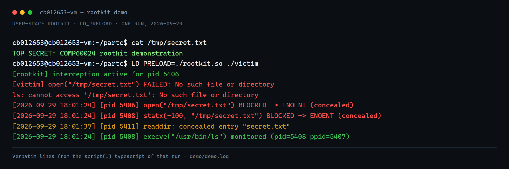

# LD_PRELOAD Rootkit (user-space demonstration)


A user-space rootkit built with `LD_PRELOAD` symbol interposition. It hooks libc calls inside any
process it is loaded into, hides a target file from the filesystem API and from directory listings,
and writes a timestamped audit trail of every call it intercepts.

Written for an operating systems internals and biometrics module (COMP60024, Part C: rootkit
demonstration), on my own Ubuntu VM. Two files, no kernel module, no build dependencies beyond gcc.

## What it actually does

`src/rootkit.c` resolves the real libc symbols with `dlsym(RTLD_NEXT, ...)` and interposes:

| Hooked call | Behaviour |
|---|---|
| `open`, `openat` | returns `-1` with `errno = ENOENT` for the concealed path |
| `stat`, `lstat`, `statx`, `access` | same concealment, so metadata queries fail as if the file does not exist |
| `readdir` | drops the concealed entry out of directory listings |
| `read` | logs the byte count of reads it passes through |
| `printf`, `fork`, `execve` | logged, plus the child pid for `fork` |

Concealment keys on a substring match against the target filename (`HIDDEN_FILE`, `secret.txt`), so
any path containing it is hidden. Every interception is timestamped and written to
`/tmp/rootkit.log` prefixed with the process id. A `__thread int` recursion guard stops the logging
path from re-entering the hooks it is itself calling. An `__attribute__((constructor))` function
announces the load, which is why each child process from `fork`/`execve` logs that it loaded too.

`src/victim.c` is the target program: it reads the concealed file, shells out to `ls -l` on it, then
`fork` + `execve`s `/bin/uname`, so the demo exercises the file API, the directory API and process
creation in one run.

## Proof

[`demo/demo.log`](demo/demo.log) is the unedited `script(1)` typescript of the run (2026-09-29). The
sequence it captures:

```
# without the rootkit, the file is readable
cb012653@cb012653-vm:~/partc$ cat /tmp/secret.txt
TOP SECRET: COMP60024 rootkit demonstration

# with LD_PRELOAD, the same open is refused and the file vanishes from ls
cb012653@cb012653-vm:~/partc$ LD_PRELOAD=./rootkit.so ./victim
[rootkit] interception active for pid 5406
[2026-09-29 18:01:24] [pid 5406] open("/tmp/secret.txt") BLOCKED -> ENOENT (concealed)
[2026-09-29 18:01:24] [pid 5408] statx(-100, "/tmp/secret.txt") BLOCKED -> ENOENT (concealed)
[2026-09-29 18:01:37] [pid 5411] readdir: concealed entry "secret.txt"
[2026-09-29 18:01:24] [pid 5409] execve("/bin/uname") monitored (pid=5409 ppid=5406)
```

Log lines for pids 5407-5409 show the child processes inheriting the preloaded library, which is why
concealment survives into `ls` and into the exec'd binary.

## Build and run

```bash
make                     # builds rootkit.so and victim
sudo sh -c 'echo "TOP SECRET" > /tmp/secret.txt'

./victim                                    # no rootkit: file reads normally
LD_PRELOAD=./rootkit.so ./victim            # concealed + logged
cat /tmp/rootkit.log                        # the audit trail
```

## Limits (what this does not do)

- **User-space only.** It hooks libc, so it only applies to processes started with `LD_PRELOAD`.
- A statically linked binary, or anything issuing raw syscalls, bypasses it entirely.
- It is not persistent and does not survive a reboot; there is no kernel module here.
- It is trivially detectable: `LD_PRELOAD` is visible in the environment, and `/tmp/rootkit.log`
  logs its own activity by design.

Those limits are the point of the exercise. A kernel-level rootkit would hook the syscall table
instead, which is a different technique with a different footprint.

## Authorized use

Demonstration code, run against my own VM and my own files, with no persistence and no third-party
targets. Do not load this into a system you do not own or have written permission to test.

## Author

**Faraj Farook** (CB012653) - `rootkit.c`, `victim.c` and the demo recording.

## The reports as submitted

The original submitted documents are in [`reports/`](reports/), kept alongside the write-up above so the artefact can be checked directly.

## What the demo looks like



That is a rendering of the recorded typescript, not a screenshot of the desktop: the lines are taken
verbatim from `demo/demo.log`, with the terminal control codes stripped out. The same file reads fine
on the first line and returns ENOENT for every attempt after `LD_PRELOAD` goes on.

## License

MIT, see [LICENSE](LICENSE).
